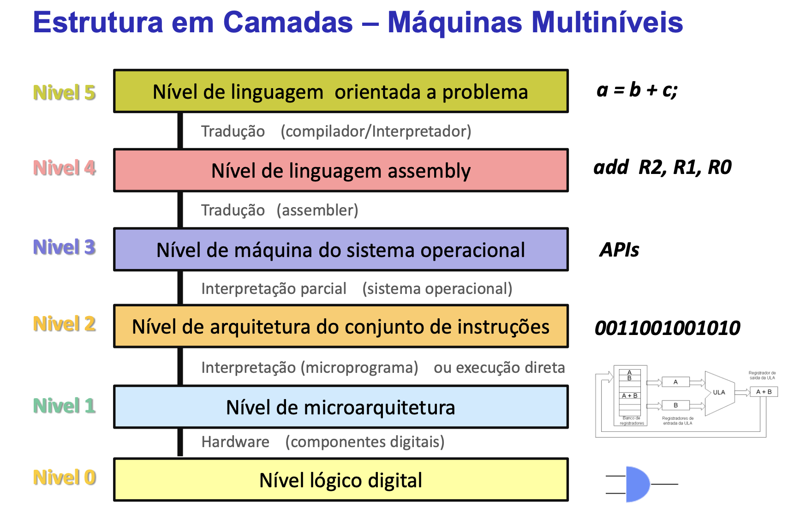
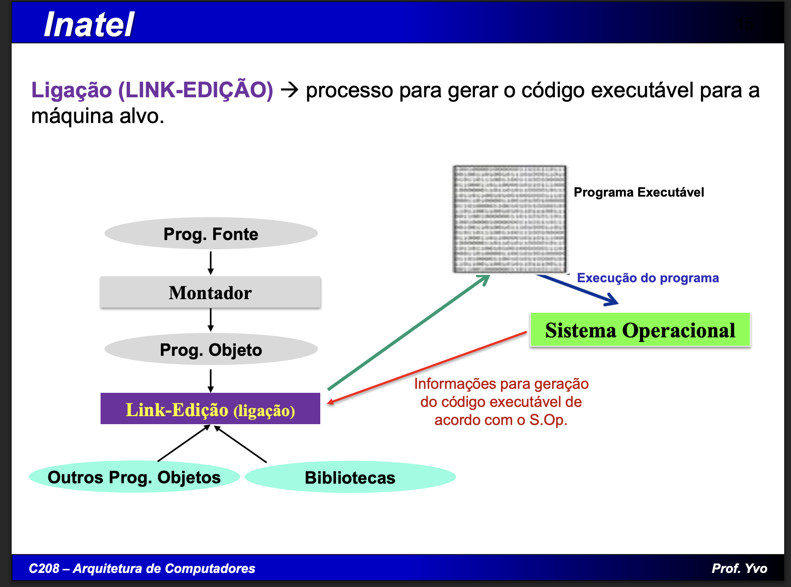

Na estrutura em camadas de uma máquina multiníveis, as instruções assembly escritas no nível 4 (nível de linguagem assembly).
Para que possam ser executadas pelos circuitos digitais é necessário um arquivo do tipo executável, composto apenas em zeros e uns.
Quais etapas devem ser realizadas para que as instruções em nível 4 deem origem ao arquivo executável?
Explique o que faz cada uma destas etapas
------
R: 
